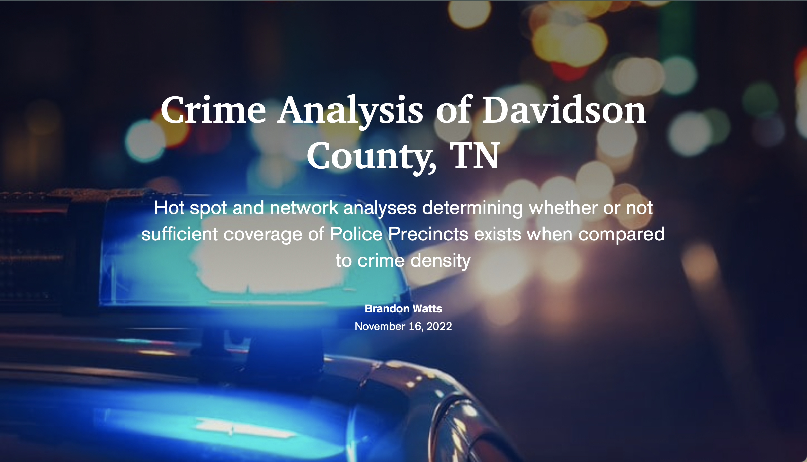
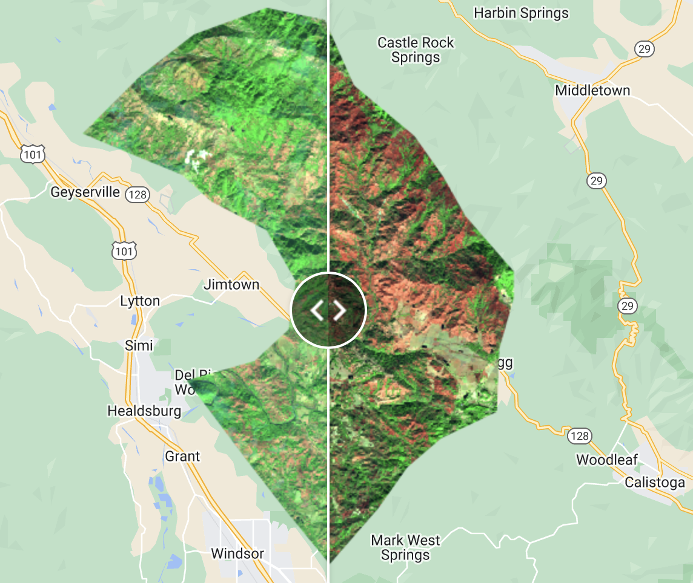
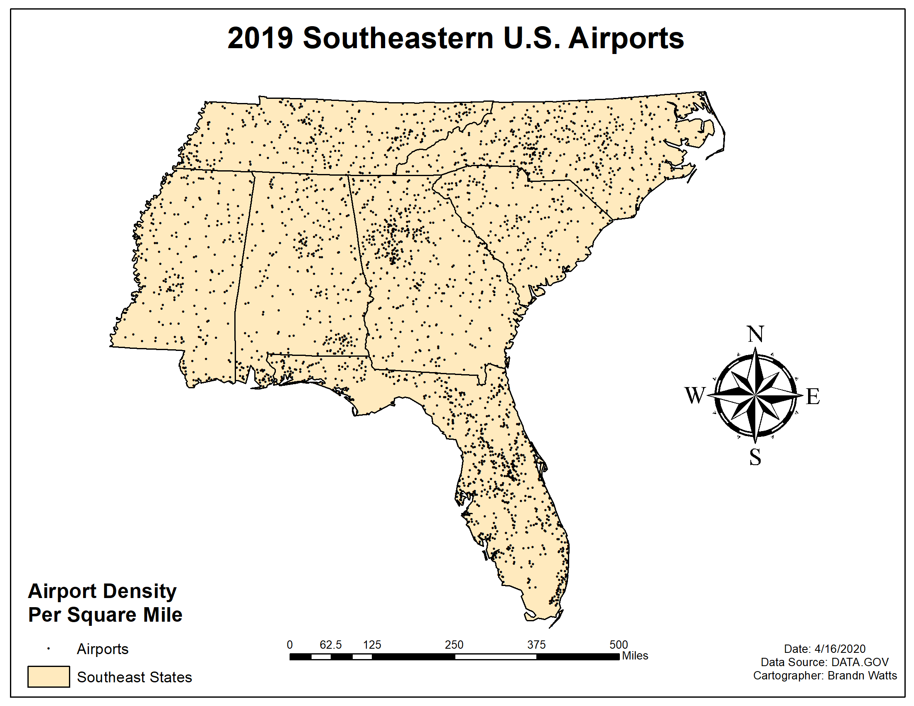
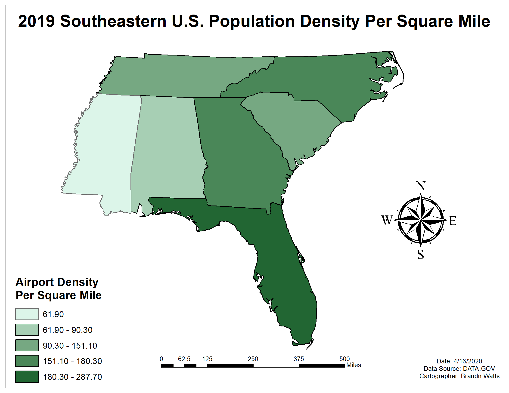
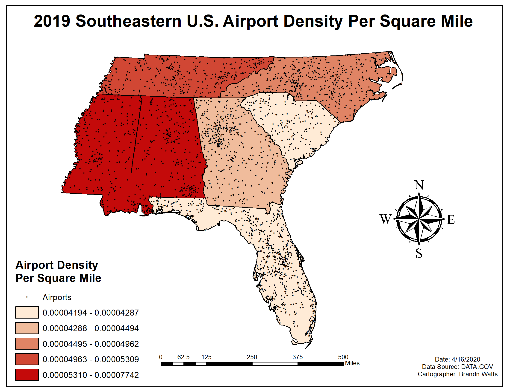
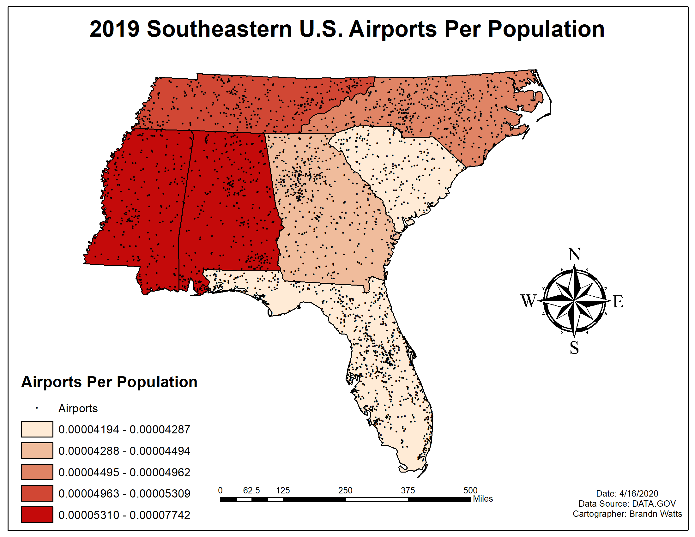

## Geospatial Project Portfolio

---

### Academic Projects 

2020 Total House Vacancy Status by Census Block Cleveland County, OK

---
Nashville, Tennessee Crime Rate: Is it safe?

---

---

### Professional Projects

- 2019 Southeastern U.S. Airports Analysis

- [Project 2 Title](http://example.com/)

---

---

Page template forked from <a href="https://github.com/evanca/quick-portfolio">evanca</a>

<!-- Remove above link if you don't want to attibute -->

